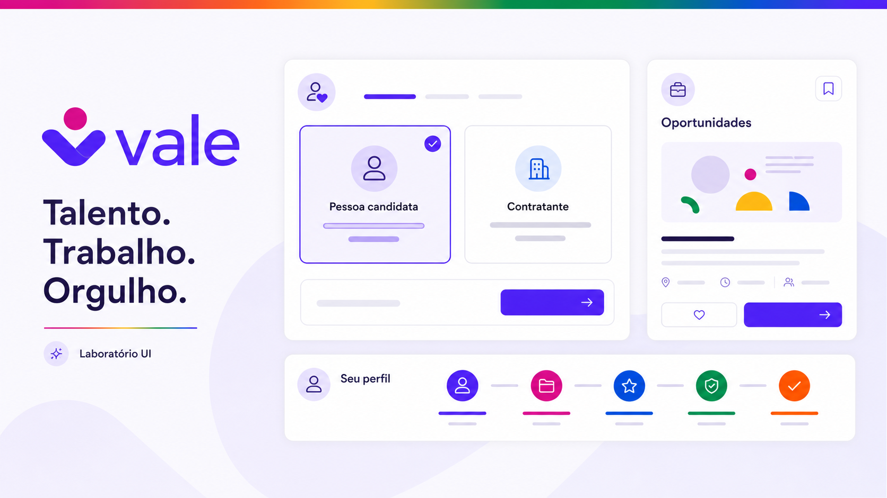

# Plano de aplicação do design do Vale

Este plano transforma o laboratório visual em um sistema de interface reutilizável e aplica essa
base aos fluxos reais do Vale em etapas pequenas, verificáveis e alinhadas ao
[plano de ação do MVP](09-plano-de-acao-mvp.md).

A evolução proposta preserva regras de negócio, segurança, privacidade e autorização já
implementadas. O trabalho de design melhora a experiência, mas não altera silenciosamente os
contratos que tornam o produto confiável.

## Visão proposta

A prancha resume a direção do laboratório: superfícies claras, ação principal violeta, cores da
comunidade usadas como acentos e experiências consistentes para cadastro, oportunidades e perfil.

## Objetivo

Aplicar uma experiência acolhedora, clara e consistente nos fluxos de identidade, perfis, mercado e
governança sem interromper as entregas funcionais do produto.

A rota `/laboratorio-ui` é a referência visual inicial. Ela não deve ser copiada integralmente para
outras páginas: os padrões aprovados devem ser extraídos como componentes reais, e o próprio
laboratório deve passar a consumir esses mesmos componentes.

Ao final do plano:

- as rotas funcionais usam a mesma linguagem visual do laboratório;
- tokens e componentes formam a fonte de verdade da interface;
- cada fluxo trata carregamento, vazio, erro, sucesso, bloqueio e falta de permissão;
- responsividade, conteúdo inclusivo e acessibilidade fazem parte da entrega;
- a migração pode continuar sem recriar decisões visuais a cada nova tela.

## Diagnóstico atual

| Área | Estado atual | Direção |
| --- | --- | --- |
| Referência visual | `/laboratorio-ui` apresenta fundações, componentes, fluxos e estados | manter como catálogo vivo dos componentes usados em produção |
| Tema | Tailwind possui tokens semânticos de cor, mas ainda convive com variáveis e CSS legado | completar os tokens por função e remover o legado somente após migrar seus consumidores |
| Componentes | componentes de domínio já existem, enquanto vários padrões visuais permanecem locais no laboratório ou no CSS global | separar primitivas de interface, padrões compostos e componentes de domínio |
| Fluxos | as fases funcionais do MVP estão implementadas, porém com níveis diferentes de acabamento | migrar por fluxo vertical, preservando contratos, permissões e comportamento |
| Qualidade | typecheck, lint, testes unitários e build existem; auditoria de navegador, acessibilidade e regressão visual ainda é pendente | adicionar validação proporcional ao risco de cada etapa |
| Documentação | ADR, requisito transversal e runbook já registram a direção escolhida | atualizar a evidência junto com cada lote migrado |

O principal risco não é a falta de uma proposta visual. É manter duas linguagens de interface por
tempo indeterminado ou reproduzir o laboratório em cada rota sem extrair uma base compartilhada.

## Escopo da melhoria

| Incluído | Não incluído neste plano |
| --- | --- |
| consolidar tokens, componentes e padrões de layout | refazer a identidade visual ou criar uma nova marca |
| migrar as rotas e os componentes funcionais existentes | adicionar funcionalidades de negócio não previstas no MVP |
| melhorar hierarquia, navegação, formulários e feedbacks | transferir autorização ou validação do backend para o frontend |
| cobrir responsividade, teclado, contraste, zoom e leitor de tela | alterar contratos da API apenas para acomodar uma escolha visual |
| criar testes de interface e evidências por etapa | migrar toda a aplicação de uma só vez |

Uma necessidade funcional descoberta durante a migração deve voltar ao plano da fase correspondente.
Ela não deve ser incorporada como mudança visual sem análise de produto, segurança e privacidade.

## Princípios de aplicação

| Princípio | Regra prática |
| --- | --- |
| Clareza antes da decoração | cada tela deve ter uma ação principal inequívoca e hierarquia de leitura curta |
| Cor com função | violeta identifica ação; demais cores reforçam categorias ou estados, nunca comunicam sozinhas |
| Privacidade por padrão | campos sensíveis são opcionais, explicam finalidade e não bloqueiam oportunidades |
| Inclusão na linguagem | textos não presumem gênero, identidade, trajetória, família ou capacidade |
| Reuso antes da variação | uma nova solução visual exige verificar primeiro os componentes existentes |
| Consistência com contexto | o mesmo padrão pode variar de densidade, nunca de significado ou comportamento |
| Acessibilidade verificável | teclado, foco, contraste, rótulos e estados entram na definição de pronto |
| Backend como autoridade | componentes melhoram a experiência, mas não substituem autorização ou validação da API |
| Migração segura | CSS legado só é removido quando todos os seus consumidores estiverem identificados e migrados |

## Estratégia de execução

Cada etapa deve ser entregue como uma fatia vertical e seguir o mesmo ciclo:

1. inventariar rotas, estados, permissões, conteúdo e padrões repetidos;
2. compor a solução com tokens e componentes existentes;
3. extrair ou evoluir apenas os padrões que realmente serão reutilizados;
4. aplicar o design ao fluxo integrado com a API;
5. validar comportamento, responsividade, acessibilidade e regressão;
6. registrar evidências, limites conhecidos e próximo marco.

| Nível | Uso |
| --- | --- |
| Fundação | tokens, tipografia, ícones, foco, movimento, superfícies e espaçamento |
| Primitiva | botão, campo, seletor, checkbox, badge, alerta, card e diálogo |
| Padrão composto | cabeçalho de página, formulário por seções, filtros, vazio, tabela e linha do tempo |
| Domínio | autenticação, perfil, vaga, candidatura, denúncia, moderação e auditoria |

Essa separação evita componentes genéricos demais e impede que detalhes de negócio sejam incorporados
às primitivas visuais.

## Sequência de adoção

| Etapa | Estado inicial | Foco | Dependência | Resultado |
| --- | --- | --- | --- | --- |
| 1 — Fundação | referência pronta; extração pendente | tokens, primitivas, layout e qualidade base | laboratório existente | sistema de interface pronto para consumo |
| 2 — Identidade | não iniciada | entrada, cadastro, sessão e recuperação | Etapa 1 | primeira jornada real totalmente migrada |
| 3 — Perfis | em validação | onboarding, dados, privacidade e arquivos | Etapa 2 | perfis claros, seguros e retomáveis |
| 4 — Mercado | implementada localmente; auditoria manual pendente | vagas, busca, candidatura e gestão | Etapa 3 | jornada central do produto consistente |
| 5 — Governança | não iniciada | equipe, denúncias, administração e auditoria | Etapas 1 a 4 | decisões sensíveis rastreáveis e acessíveis |

As etapas definem ordem de execução, não importância. Correções críticas de segurança,
acessibilidade ou funcionamento não devem aguardar a etapa visual correspondente.

### Etapa 1 — consolidar a fundação

Objetivo: transformar as decisões do laboratório em uma base estável que possa ser usada por todas
as rotas.

#### Ações

1. inventariar tokens, seletores globais, padrões repetidos e consumidores do CSS legado;
2. completar tokens semânticos para tipografia, espaçamento, borda, raio, elevação, foco, estado e
   movimento;
3. definir a estrutura dos componentes de interface sem acoplar regras de domínio;
4. extrair as primitivas prioritárias e suas variantes;
5. fazer o laboratório consumir os componentes extraídos;
6. criar padrões de layout para página pública, área autenticada e área administrativa;
7. estabelecer testes de componente, acessibilidade e regressão adequados ao frontend.

#### Entregas

| Entrega | Resultado esperado |
| --- | --- |
| Inventário visual | relação entre classes legadas, rotas consumidoras, padrão substituto e momento seguro de remoção |
| Tokens semânticos | valores recebem nomes por função e cobrem interação, feedback e superfícies |
| Ações | botão, link de ação e botão somente com ícone possuem hierarquia, tamanho e estados previsíveis |
| Formulários | campo, área de texto, seletor, checkbox, opção, ajuda e erro compartilham a mesma estrutura |
| Feedback | alerta, badge, estado vazio, carregamento, progresso e confirmação usam semântica consistente |
| Superfícies | card, painel, divisor, cabeçalho de página e contêiner responsivo formam a base dos layouts |
| Sobreposição | diálogo ou confirmação controla foco, fechamento, contexto e ação destrutiva |
| Conteúdo | guia curto define títulos, rótulos, ajuda, validação, erro e linguagem inclusiva |
| Qualidade | testes cobrem interação essencial, semântica e variantes críticas dos componentes |

#### Critérios de saída

- novos componentes não introduzem cores ou medidas soltas quando já existe um token aplicável;
- cada primitiva documenta variantes, estados, limites de uso e comportamento por teclado;
- componentes usados na aplicação são os mesmos apresentados no laboratório;
- o layout permanece utilizável em 320 px, 768 px, 1280 px ou mais e com zoom de 200%;
- movimento respeita a preferência por redução de animações;
- a convivência temporária com o CSS legado está mapeada e não altera telas ainda não migradas;
- typecheck, lint, testes e build do frontend passam.

Marco: fundação real publicada no código, consumida pelo laboratório e pronta para a primeira jornada
funcional.

### Etapa 2 — aplicar na identidade

Objetivo: migrar a jornada de entrada como primeiro fluxo real, pois ela concentra formulário,
consentimento, sessão, redirecionamento e recuperação de erro.

#### Ordem recomendada

1. estrutura pública, marca, navegação mínima e escolha entre pessoa candidata e contratante;
2. cadastro com nome, e-mail, senha e consentimentos independentes definidos pelo produto;
3. login e retorno seguro ao destino correto;
4. verificação de e-mail e reenvio de código;
5. recuperação e redefinição de senha;
6. conta indisponível, sessão expirada e destinos iniciais por papel e estado da conta;
7. estrutura base da área autenticada.

#### Rotas e padrões

| Área | Aplicação do padrão |
| --- | --- |
| `/` | apresentação objetiva, escolha de papel, cadastro, login e feedback de sessão |
| `/recuperar-senha` | solicitação, redefinição, senha válida, expiração e confirmação |
| `/conta-indisponivel` | motivo compreensível, ação possível e canal de continuidade |
| verificação no onboarding | código, reenvio, tempo de espera, erro e sucesso |
| layout de `/app` | navegação por papel, identificação da seção, saída e conteúdo principal |

#### Cuidados obrigatórios

| Tema | Regra |
| --- | --- |
| Consentimentos | apresentar separadamente o que é obrigatório, opcional, versionado e revogável |
| Erro de API | converter o erro em orientação sem ocultar o motivo útil nem expor detalhe interno |
| Formulário | preservar entradas seguras quando houver falha e levar o foco ao resumo ou campo inválido |
| Senha | permitir revelar ou ocultar com nome acessível e sem registrar o valor |
| Sessão | evitar piscar conteúdo protegido ou comunicar autorização antes da resposta confiável da API |
| Redirecionamento | explicar o próximo passo quando a conta não puder seguir para o destino solicitado |

#### Critérios de saída

- a jornada pode ser concluída apenas por teclado;
- rótulos, ajuda, requisitos e erros estão associados aos respectivos campos;
- envio, espera, sucesso, erro, expiração, bloqueio e indisponibilidade estão implementados;
- mensagens não dependem apenas de cor, ícone, placeholder ou posição;
- responsividade e zoom não escondem ações ou conteúdo legal;
- testes cobrem os caminhos críticos de cadastro, login, verificação e recuperação;
- contratos de autenticação, termos, papéis e estado da conta permanecem preservados.

Marco: uma pessoa entra, cria a conta, verifica o e-mail, recupera o acesso e chega ao destino correto
com a nova experiência de ponta a ponta.

### Etapa 3 — aplicar em perfis e privacidade

Objetivo: migrar onboarding, perfil profissional e preferências de visibilidade sem ampliar a coleta
de dados ou reduzir as proteções existentes.

#### Ordem recomendada

1. estrutura de onboarding com progresso, etapas curtas e possibilidade de retomada;
2. perfil de pessoa candidata;
3. currículo, avatar e demais arquivos;
4. visibilidade, consentimento e centro de privacidade;
5. perfil de contratante e estado de verificação institucional;
6. visualização e edição dos perfis na área autenticada.

#### Rotas e componentes

| Área | Aplicação do padrão |
| --- | --- |
| `/onboarding/candidato` | progresso, informações profissionais, dados opcionais e ativação consciente |
| `/onboarding/contratante` | organização, responsável, contato e explicação da verificação |
| `/app/candidato` | resumo do perfil, completude, currículo, candidaturas e privacidade |
| `/app/contratante` | perfil institucional, vagas, candidaturas recebidas e estado de verificação |
| formulários de perfil | seções curtas, salvamento explícito, validação contextual e retorno de sucesso |
| arquivos | formato, limite, progresso, substituição, falha, download e remoção |

#### Cuidados obrigatórios

| Fluxo | Cuidado |
| --- | --- |
| Dados públicos | mostrar uma prévia fiel do que outras pessoas poderão acessar |
| Dados restritos | explicar qual relação libera o acesso e por quanto tempo |
| Identidade e pronomes | manter opcionais, com finalidade explícita e opção de não informar |
| Visibilidade | não mudar a escolha silenciosamente para concluir outra ação |
| Arquivos | não usar nome, miniatura ou mensagem que exponha conteúdo sensível fora do contexto autorizado |
| Alterações destrutivas | diferenciar remover arquivo, desativar perfil e excluir conta |

#### Critérios de saída

- a pessoa entende a visibilidade antes de publicar ou ativar o perfil;
- o onboarding informa progresso sem bloquear a navegação assistiva;
- seções longas preservam dados seguros e levam o foco ao primeiro erro;
- upload informa formato, limite, progresso, sucesso, falha e possibilidade de tentar novamente;
- componentes não exibem campos ausentes como falha quando o dado é opcional;
- os modos `private`, `applications_only` e `verified_employers` mantêm o significado definido pela
  API;
- testes cobrem edição, retomada, visibilidade, upload e respostas negativas de permissão.

Marco: pessoas candidatas e contratantes conseguem criar, compreender, revisar e manter seus perfis
sem dúvida sobre finalidade ou visibilidade dos dados.

### Etapa 4 — aplicar no mercado

Objetivo: cobrir a jornada central do produto, do encontro de uma oportunidade ao acompanhamento da
candidatura e à gestão da vaga.

#### Ordem recomendada

1. busca, filtros, ordenação, paginação e estado vazio;
2. card e detalhe de vaga;
3. revisão dos dados compartilhados e confirmação da candidatura;
4. acompanhamento de candidatura pela pessoa candidata;
5. criação, revisão e gestão de vaga pela pessoa contratante;
6. candidaturas recebidas e transições permitidas;
7. moderação prévia de vagas pela equipe.

#### Áreas e componentes

| Área | Componentes principais |
| --- | --- |
| `/vagas` | busca, filtros, resumo aplicado, card, paginação, carregamento e vazio |
| `/vagas/[id]` | resumo, requisitos, organização, faixa, modalidade, denúncia e ação principal |
| candidaturas da pessoa candidata | status, histórico, próximo passo, cancelamento e vazio |
| gestão da pessoa contratante | formulário de vaga, revisão, publicação, estado e candidaturas recebidas |
| moderação de vagas | fila, contexto, decisão, motivo, confirmação e histórico |

#### Cuidados obrigatórios

| Tema | Regra |
| --- | --- |
| Busca | manter filtros compreensíveis, removíveis e refletidos no resultado |
| Card | priorizar decisão; não repetir todo o conteúdo do detalhe |
| Candidatura | revisar quais dados e qual currículo serão compartilhados antes da confirmação |
| Estado | combinar nome, explicação e próximo passo; não depender da cor do badge |
| Transição | exibir apenas ações permitidas, mas tratar a resposta negativa da API corretamente |
| Moderação | separar correção solicitada, rejeição, pausa e encerramento |

#### Critérios de saída

- o caminho `buscar → compreender → candidatar-se → acompanhar` é concluído sem ambiguidade;
- filtros funcionam por teclado e não provocam mudanças de contexto inesperadas;
- carregamento não causa deslocamento que esconda ações ou altere a leitura;
- a candidatura confirma conscientemente dados, currículo e visibilidade;
- estados de vaga e candidatura possuem linguagem consistente para cada papel;
- formulários longos permitem revisão antes de uma ação irreversível;
- testes cobrem a jornada principal e as respostas negativas de propriedade, estado e permissão.

Marco: pessoa candidata, contratante e equipe concluem suas partes da jornada de oportunidade com a
mesma linguagem visual e de estado.

### Etapa 5 — aplicar em governança

Objetivo: fechar moderação, denúncias, administração, privacidade operacional e auditoria com padrões
adequados a decisões densas e sensíveis.

#### Ordem recomendada

1. navegação e painel de trabalho da equipe;
2. criação e acompanhamento de denúncias;
3. fila e detalhe de moderação;
4. administração de usuários e estados de conta;
5. auditoria, filtros e detalhe do evento;
6. pedidos de privacidade e demais operações sensíveis existentes.

#### Rotas e padrões

| Área | Aplicação do padrão |
| --- | --- |
| `/app/equipe` | prioridades, filas, estados, responsáveis e acesso rápido ao contexto |
| `/admin` | visão operacional curta, pendências e navegação administrativa |
| `/admin/usuarios` | busca, filtros, tabela responsiva, estado da conta e ações contextuais |
| `/admin/auditoria` | filtros, resultado paginado, evento, ator, data e contexto permitido |
| denúncias | criação, confirmação, acompanhamento, decisão e histórico |
| privacidade | solicitação, prazo, estado, consequência e confirmação de identidade |

#### Cuidados obrigatórios

- diferenciar alerta informativo, risco e ação irreversível;
- exigir confirmação contextual para ações destrutivas ou que alterem acesso;
- exibir estado, responsável, data e motivo quando essa informação puder ser apresentada;
- manter dados restritos fora de cards, notificações, URLs e mensagens genéricas;
- adaptar tabelas para telas pequenas sem esconder contexto ou ações;
- comunicar ausência de permissão sem revelar a existência de recurso protegido;
- testar permissão positiva e negativa por papel.

#### Critérios de saída

- decisões sensíveis informam objeto, consequência e possibilidade de reversão antes da confirmação;
- filas mantêm filtros, paginação, seleção e retorno de navegação previsíveis;
- tabelas possuem cabeçalhos, nomes acessíveis e alternativa utilizável em tela pequena;
- histórico apresenta ordem, autoria e motivo sem expor dados desnecessários;
- estados de processamento longo informam andamento e forma segura de retorno;
- testes cobrem ações administrativas críticas, denúncias, auditoria e negações por papel.

Marco: a interface torna decisões sensíveis rastreáveis, compreensíveis e operáveis sem expor dados
desnecessários.

## Frentes transversais

Estas frentes acompanham todas as etapas e não devem ser concentradas em uma revisão final.

| Frente | Aplicação contínua |
| --- | --- |
| Conteúdo | revisar título, instrução, rótulo, ajuda, erro, confirmação e próximo passo |
| Acessibilidade | usar WCAG 2.2 AA como referência e validar semântica, teclado, foco, contraste, zoom, leitor de tela e redução de movimento |
| Responsividade | projetar a partir do conteúdo e testar quebra, ordem, densidade e áreas de toque |
| Privacidade | minimizar exposição, explicar finalidade e respeitar visibilidade definida pela API |
| Segurança | tratar o frontend como experiência, nunca como única barreira de autorização |
| Estados | projetar antes da integração os estados inicial, carregando, vazio, erro, sucesso e bloqueio |
| Desempenho | evitar ícones, fontes, imagens ou efeitos que prejudiquem a resposta das jornadas principais |
| Qualidade | combinar teste de componente, integração, E2E, auditoria manual e evidência visual |

## Processo para cada nova tela

1. identificar a história, papel, permissão, dado sensível e ação principal;
2. mapear os estados inicial, carregando, sucesso, vazio, erro, bloqueado e sem permissão;
3. definir a hierarquia de título, conteúdo, ação principal e ações secundárias;
4. montar a tela usando componentes existentes;
5. adicionar uma variante ao laboratório somente quando ela for reutilizável;
6. integrar sem duplicar validação ou regra que pertence à API;
7. revisar conteúdo, privacidade e acessibilidade antes da aprovação visual;
8. validar responsividade, teclado, zoom, contraste e integração;
9. registrar a evidência no arquivo da fase em `requirements/`;
10. atualizar ADR ou runbook apenas quando uma decisão ou procedimento realmente mudar.

## Estratégia de validação

| Momento | Validações mínimas |
| --- | --- |
| Durante o componente | variantes, eventos, teclado, nome acessível, foco e conteúdo |
| Durante a integração | respostas da API, preservação de dados, permissões e todos os estados aplicáveis |
| Antes de concluir a etapa | 320 px, 768 px, 1280 px ou mais, zoom de 200% e navegação sem mouse |
| No fluxo crítico | teste E2E do caminho principal e das negações com maior risco |
| Antes de integrar a mudança | typecheck, lint, testes e build do frontend |
| Após a entrega | evidência atualizada, limitações registradas e laboratório sincronizado |

Regressão visual automatizada deve proteger componentes e páginas estáveis, sem transformar pequenas
diferenças irrelevantes em bloqueio. A auditoria manual continua necessária para leitura, conteúdo,
ordem de foco e qualidade da interação.

## Indicadores de evolução

| Indicador | Evidência de sucesso |
| --- | --- |
| Adoção | cada rota migrada usa tokens e componentes compartilhados em vez de recriar o padrão |
| Consistência | o laboratório renderiza os mesmos componentes consumidos pelos fluxos reais |
| Cobertura de estados | fluxos críticos possuem carregamento, vazio, erro, sucesso e bloqueio quando aplicáveis |
| Acessibilidade | não há violação crítica conhecida contra a referência WCAG 2.2 AA e a jornada principal funciona sem mouse |
| Responsividade | nenhuma ação ou informação essencial fica oculta nas larguras e no zoom definidos |
| Segurança e privacidade | testes negativos confirmam que a melhoria visual não altera autorização ou exposição |
| Redução do legado | seletores antigos são removidos junto com o último consumidor, com regressão validada |
| Manutenção | uma mudança de padrão é feita no componente ou token, não repetida em várias páginas |

## Definição de pronto de interface

Uma tela só está pronta quando:

- usa tokens e componentes aprovados;
- preserva o contrato funcional e as regras de permissão;
- possui título, ação principal e retorno de navegação claros;
- funciona sem mouse e mantém foco visível em ordem coerente;
- associa rótulos, ajuda e erros aos campos;
- não depende apenas de cor, ícone, placeholder ou posição;
- trata carregamento, vazio, erro, sucesso e indisponibilidade aplicáveis;
- respeita as permissões e visibilidades validadas pelo backend;
- foi verificada em tela pequena, média e grande e com zoom de 200%;
- respeita a preferência por redução de movimento;
- possui teste proporcional à criticidade do fluxo;
- atualiza laboratório e documentação quando o padrão compartilhado muda;
- remove CSS substituído apenas depois de validar todos os consumidores.

## Riscos e mitigação

| Risco | Mitigação |
| --- | --- |
| migração ampla causar regressões funcionais | trabalhar por jornada vertical e manter o contrato da API como referência |
| CSS novo e legado entrarem em conflito | mapear consumidores, limitar o alcance e remover regras somente após a migração |
| laboratório divergir da produção | fazer o laboratório consumir os mesmos componentes exportados para as rotas |
| abstração prematura criar componentes difíceis de usar | extrair padrões comprovados e manter domínio fora das primitivas |
| acessibilidade ficar para o fim | incluir critérios e testes em cada etapa e em cada componente |
| melhoria visual ampliar o escopo do produto | devolver necessidades funcionais ao plano e ao requisito de origem |
| cor da comunidade perder significado por excesso | reservar cores de apoio para função, categoria, marca ou celebração |
| páginas administrativas ficarem densas demais | priorizar tarefa, filtros e contexto; revelar detalhe progressivamente |

## Governança e manutenção

| Evento | Ação |
| --- | --- |
| Novo token | justificar a função e atualizar laboratório, ADR quando necessário e documentação |
| Novo componente | provar reuso em pelo menos dois contextos ou justificar a exceção |
| Nova variante | documentar estado, acessibilidade e limites de uso |
| Mudança visual incompatível | migrar consumidores, validar regressão e registrar impacto |
| Exceção temporária | abrir pendência com responsável, motivo e condição de remoção |
| Componente removido | confirmar ausência de consumidores e retirar exemplo, teste e estilo obsoletos |
| Nova regra de negócio | atualizar primeiro contrato e requisito; depois representar a regra na interface |

O laboratório deve acompanhar o código em produção. Exemplos obsoletos reduzem confiança e devem ser
removidos ou atualizados na mesma mudança que altera o componente real.

## Primeiro ciclo de execução

O trabalho pode começar com este lote:

1. registrar o inventário das variáveis, classes e padrões mais usados em `apps/web/app/globals.css`;
2. relacionar cada padrão legado às rotas e aos componentes que ainda o consomem;
3. fechar os tokens e as APIs das primitivas necessárias à jornada de identidade;
4. extrair ação, campo, seleção de papel, feedback, card e estrutura de página;
5. substituir no laboratório os exemplos locais pelos componentes reais;
6. migrar cadastro e login sem alterar contratos de autenticação e consentimento;
7. cobrir teclado, responsividade, estados de API e testes da jornada;
8. registrar a entrega em
   [`requirements/design-system-interface.md`](../requirements/design-system-interface.md);
9. usar o [runbook de aplicação](../runbooks/aplicar-design-system.md) como checklist da mudança;
10. iniciar a recuperação de senha somente depois de estabilizar os padrões extraídos.

Marco imediato: concluir a fundação mínima e entregar cadastro e login como a primeira referência de
produção do novo design.
